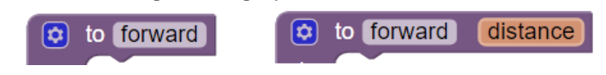

# 5.02 Logo Part 2

1. Include a **screenshot** of an  interesting design that your Logo app made and a **screenshot** of the code that created it. Press the power button and volume down at the same time to take a **screenshot**.  ***Include this image and code in your write-up document, below.***

2. Consider the following two logo procedures:

a. What is the limitation of the procedure forward()?

b. What improvement is made by adding a parameter and updating the procedure to forward(distance)?

3. Consider the following two logo procedures:

a. What is the limitation of the procedure turn()?

b. How did abstracting the turn procedure with a parameter provide the ability to solve a problem that couldn’t be solved otherwise?
