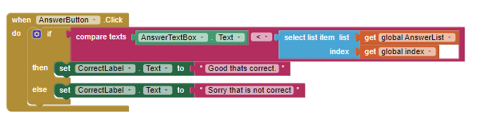

# 5.05 Quiz App

1. Consider one of the lists used in this program.

a. What is the name of the list?

The name of the list is “answerList”. 

b. Paste a screenshot of where the list has elements added to it.

.

c. Paste a screenshot of where a list element is accessed.

.

d. What does the data contained in the list represent in the program?

e. Explain how the selected list manages complexity in your program code by explaining why your program code could not be written, or how it would be written differently, if you did not use the list.

2. Describe how parallel lists were used in this app. Why was the parallel structure of the lists necessary?

3. Include screenshots of your code for exercises 2 and 3 from the Enhancements section.

4. Include a screenshot of the code that added your extra question (exercise 4). Explain why the code for the buttons worked without any changes after the addition of the extra question.
